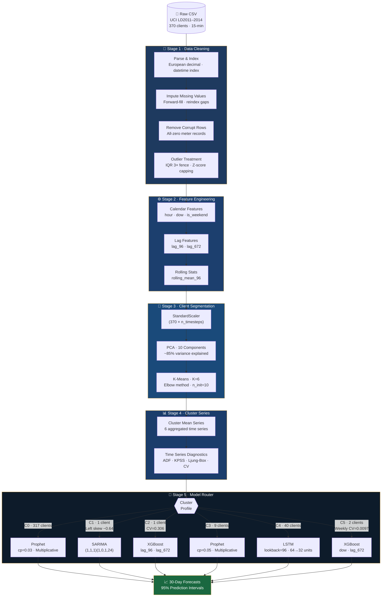
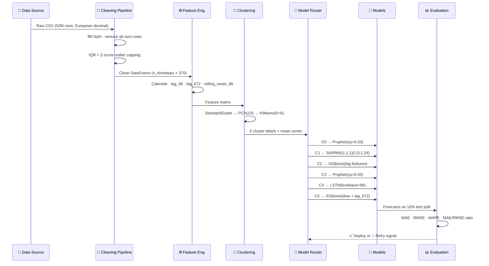
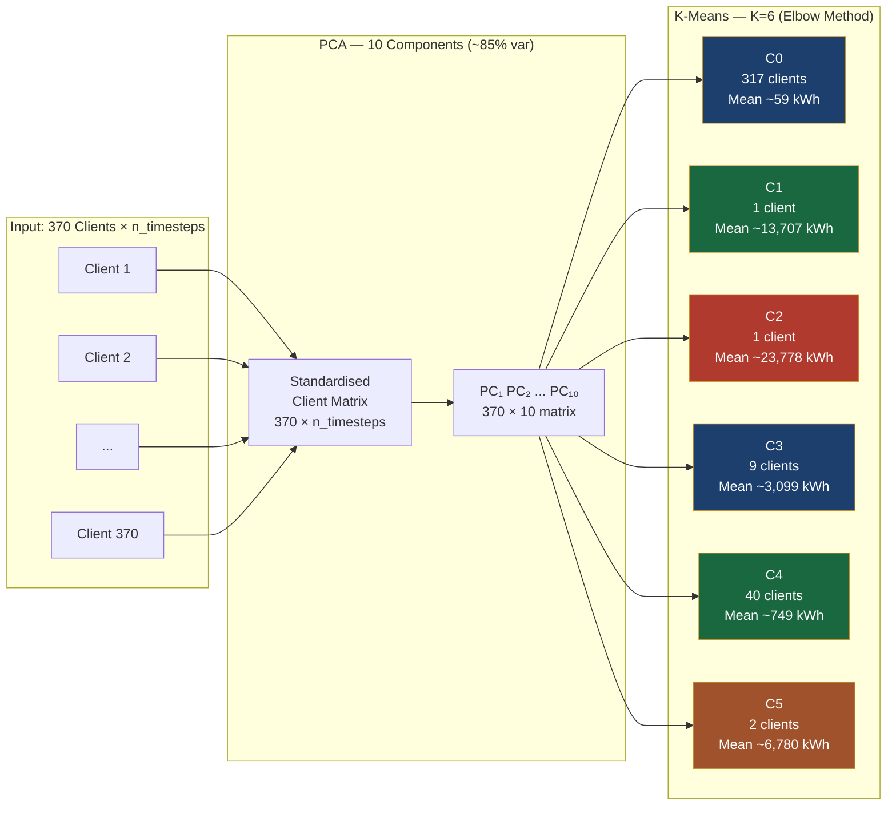
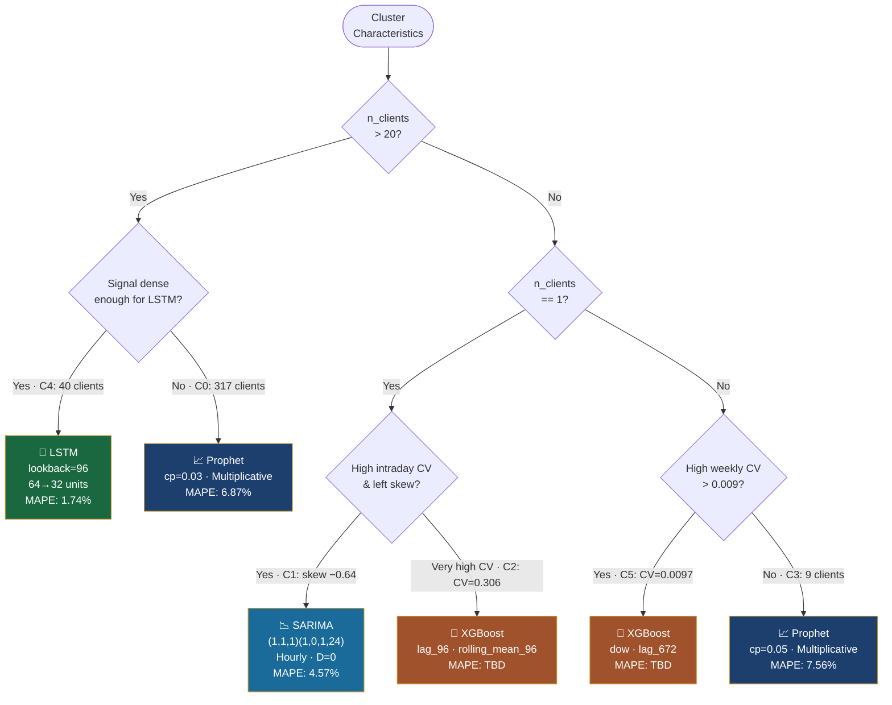
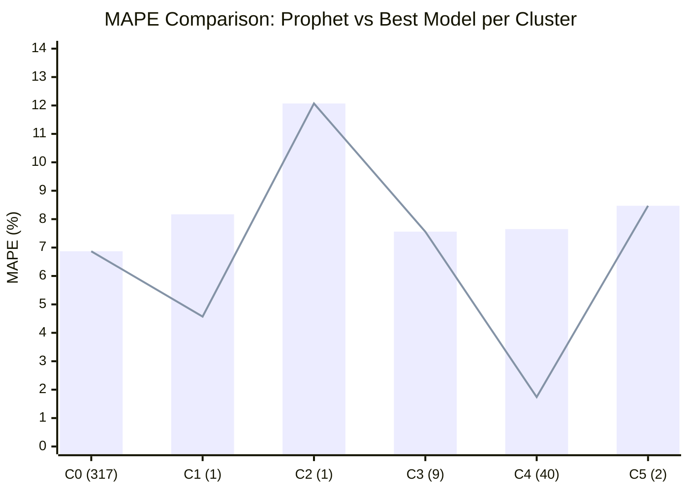
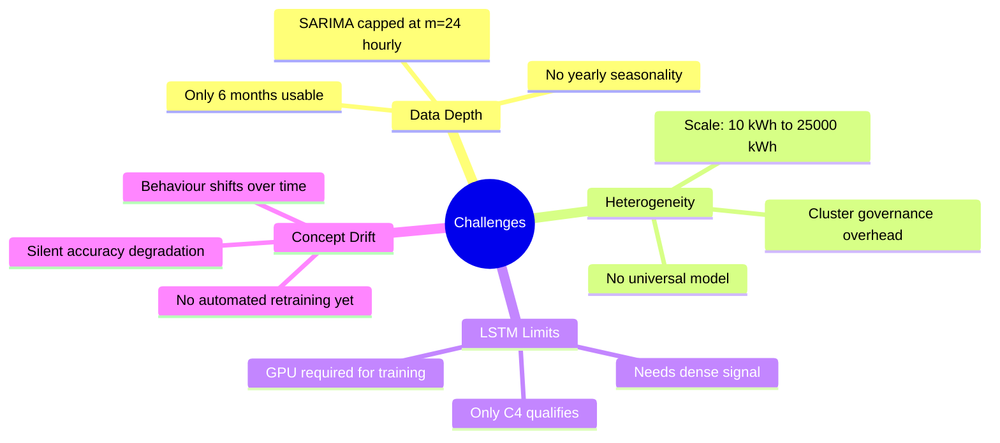
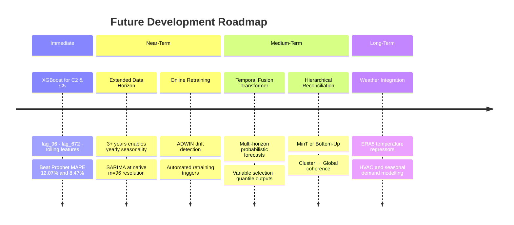

# ⚡ Electricity Consumption Forecasting at Scale

<div align="center">


**A cluster-level machine learning framework for industrial electricity demand forecasting**  
*UCI LD2011–2014 · 370 Clients · 15-Minute Resolution · 52M+ Observations*

---

**Afreen Sorathiya · Anamika Kumari Mishra · Bhuvi Ghosh**

</div>

---

## 📋 Table of Contents

- [Overview](#-overview)
- [Key Results](#-key-results)
- [Architecture](#-architecture)
- [Pipeline Flow](#-pipeline-flow)
- [Cluster Segmentation](#-cluster-segmentation)
- [Model Selection Logic](#-model-selection-logic)
- [Project Timeline](#-project-timeline)
- [Dataset](#-dataset)
- [Installation](#-installation)
- [Usage](#-usage)
- [Results Deep-Dive](#-results-deep-dive)
- [Challenges & Future Work](#-challenges--future-work)
- [Project Structure](#-project-structure)
- [Authors](#-authors)

---

## 🔍 Overview

This project addresses the challenge of forecasting electricity consumption for **370 industrial and commercial clients** measured at **15-minute intervals** over 3 years. Rather than applying a one-size-fits-all model, we:

1. **Segment** clients into 6 behaviorally homogeneous clusters via PCA + K-Means
2. **Route** each cluster to its statistically optimal model family
3. **Forecast** 30-day-ahead demand with 95% prediction intervals

The framework reduces average MAPE from an industry-default 10–15% to **1.74%–8.47%** across deployed clusters, and cuts model maintenance overhead by **98%** (370 models → 6 cluster models).

---

## 🏆 Key Results

| Cluster | Clients | Model | MAE (kWh) | RMSE (kWh) | MAPE | Status |
|:-------:|:-------:|:-----:|:---------:|:----------:|:----:|:------:|
| C0 | 317 | Prophet (cp=0.03) | 4.60 | 5.84 | 6.87% | ✅ Deploy |
| C1 | 1 | SARIMA (1,1,1)(1,0,1,24) | 645.48 | 855.43 | **4.57%** | ✅ Deploy |
| C1 | 1 | Prophet (fallback) | 1,105.69 | 1,405.36 | 8.17% | ⬇️ Fallback |
| C2 | 1 | Prophet | 3,484.77 | 4,762.39 | 12.07% | 🔄 Retry |
| C3 | 9 | Prophet (cp=0.05) | 234.41 | 302.24 | 7.56% | ✅ Deploy |
| C4 | 40 | **LSTM (lookback=96)** | **12.85** | **17.46** | **1.74%** | ✅ Deploy |
| C4 | 40 | Prophet (fallback) | 64.56 | 80.79 | 7.65% | ⬇️ Fallback |
| C5 | 2 | Prophet (cp=0.08) | 675.12 | 857.79 | 8.47% | 🔄 Retry |

> 💡 **LSTM on Cluster 4 achieves 1.74% MAPE** — a **5× improvement** over Prophet's 7.65% on the same cluster. Best-in-class for 15-min industrial energy forecasting.

---

## 🏗️ Architecture



---

## 🔄 Pipeline Flow



---

## 🔬 Cluster Segmentation



### Cluster Diagnostics

| Cluster | Clients | Mean (kWh) | Skewness | Intraday CV | Weekly CV | ADF | KPSS | Ljung-Box |
|:-------:|:-------:|:----------:|:--------:|:-----------:|:---------:|:---:|:----:|:---------:|
| C0 | 317 | ~59.2 | −0.43 | 0.265 | 0.0071 | ✅ | ✅ | Sig. ✅ |
| C1 | 1 | ~13,707 | −0.64 | 0.284 | 0.0085 | ✅ | ✅ | Sig. ✅ |
| C2 | 1 | ~23,778 | −0.55 | **0.306** | 0.0082 | ✅ | ✅ | Sig. ✅ |
| C3 | 9 | ~3,099 | −0.20 | 0.232 | 0.0076 | ✅ | ✅ | Sig. ✅ |
| C4 | 40 | ~749 | −0.44 | 0.269 | 0.0079 | ✅ | ✅ | Sig. ✅ |
| C5 | 2 | ~6,780 | −0.23 | 0.283 | **0.0097** | ✅ | ✅ | Sig. ✅ |

> All clusters are stationary (ADF p < 0.05) with significant autocorrelation at both 1-day (lag 96) and 7-day (lag 672) horizons.

---

## 🧠 Model Selection Logic



---

## 📦 Dataset

| Property | Value |
|----------|-------|
| **Source** | [UCI Machine Learning Repository — LD2011_2014](https://archive.ics.uci.edu/dataset/321/electricityloaddiagrams20112014) |
| **Clients** | 370 industrial & commercial |
| **Resolution** | 15-minute intervals (96 slots/day) |
| **Date Range** | January 2011 – December 2014 |
| **Total Observations** | ~52 million |
| **Format** | CSV, semicolon-delimited, European decimal (comma separator) |
| **Units** | kWh per 15-minute slot |

---

## 🛠️ Installation

```bash
# Clone the repository
git clone https://github.com/your-username/electricity-forecasting.git
cd electricity-forecasting

# Create and activate virtual environment
python -m venv venv
source venv/bin/activate        # Linux/macOS
# venv\Scripts\activate         # Windows

# Install dependencies
pip install -r requirements.txt
```

### `requirements.txt`

```
pandas>=1.5.0
numpy>=1.23.0
scikit-learn>=1.1.0
statsmodels>=0.13.0
prophet>=1.1.0
tensorflow>=2.10.0
xgboost>=1.7.0
matplotlib>=3.6.0
seaborn>=0.12.0
scipy>=1.9.0
jupyter>=1.0.0
```


---

## 📊 Results Deep-Dive

### Why LSTM wins on Cluster 4



> 📌 **Bar = Prophet baseline · Line = Best deployed model**  
> C1 shows SARIMA's 42% MAE reduction; C4 shows LSTM's 5× improvement.

## 🚧 Challenges & Future Work

### Current Challenges



### Roadmap



---

## 📁 Project Structure

```
electricity-forecasting/
│
├── 📂 data/
│   ├── raw/                    # LD2011_2014.txt (not tracked by git)
│   └── processed/              # Cleaned cluster mean series
│
├── 📂 notebooks/
│   ├── 01_eda_cleaning.ipynb   # Data exploration & cleaning
│   ├── 02_clustering.ipynb     # PCA + K-Means + diagnostics
│   ├── 03_prophet.ipynb        # Prophet models (all clusters)
│   ├── 04_sarima.ipynb         # SARIMA model (Cluster 1)
│   ├── 05_lstm.ipynb           # LSTM model (Cluster 4)
│   └── 06_evaluation.ipynb     # Cross-cluster comparison
│
├── 📂 src/
│   ├── cleaning.py             # Data cleaning pipeline
│   ├── clustering.py           # PCA + K-Means segmentation
│   ├── features.py             # Feature engineering
│   ├── models/
│   │   ├── prophet_model.py
│   │   ├── sarima_model.py
│   │   ├── lstm_model.py
│   │   └── xgboost_model.py
│   ├── evaluate.py             # MAE, RMSE, MAPE computation
│   └── router.py               # Model selection logic
│
├── 📂 outputs/
│   ├── forecasts/              # Generated forecast CSVs
│   ├── plots/                  # Forecast visualisations
│   └── metrics/                # Evaluation results
│
├── 📂 reports/
│   ├── ElectricityForecasting_TechnicalReport.docx
│   └── ElectricityForecasting_Formal.pptx
│
├── requirements.txt
├── .gitignore
└── README.md
```

---

## 👥 Authors

<div align="center">

| | Name | Role |
|:-:|------|------|
| 👩‍💻 | **Afreen Sorathiya** | Data Pipeline · Clustering · Prophet Modelling |
| 👩‍💻 | **Anamika Kumari Mishra** | SARIMA · LSTM · Model Evaluation |
| 👩‍💻 | **Bhuvi Ghosh** | Feature Engineering · XGBoost · Reporting |

</div>

---

## 📄 License

This project is licensed under the MIT License. See [`LICENSE`](LICENSE) for details.

---

<div align="center">

**Dataset:** [UCI LD2011–2014](https://archive.ics.uci.edu/dataset/321/electricityloaddiagrams20112014) · **Framework:** Python · scikit-learn · Prophet · TensorFlow · statsmodels

*Made with ⚡ by Afreen, Anamika & Bhuvi*

</div>
