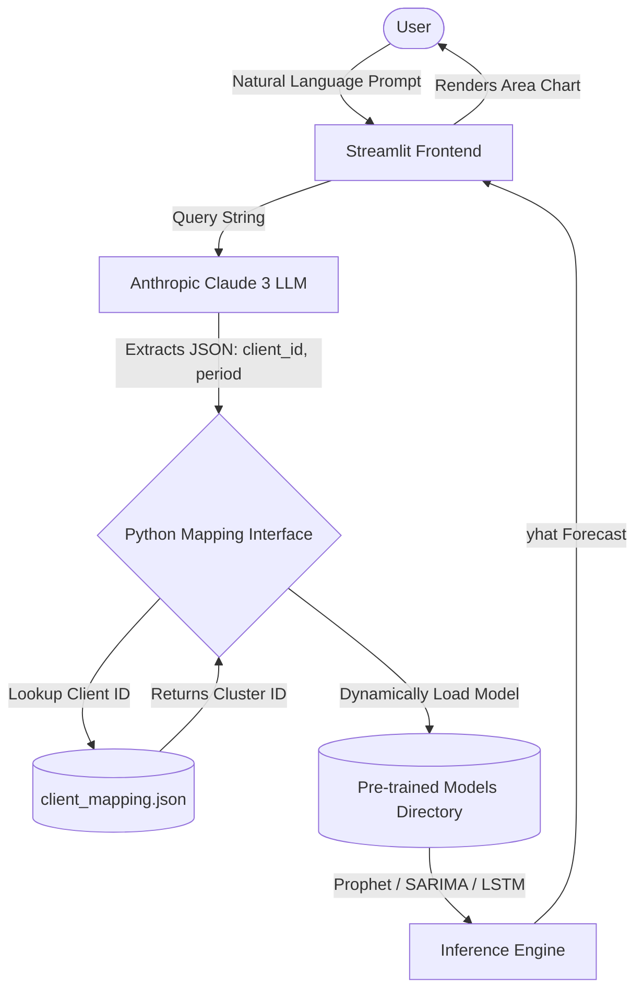
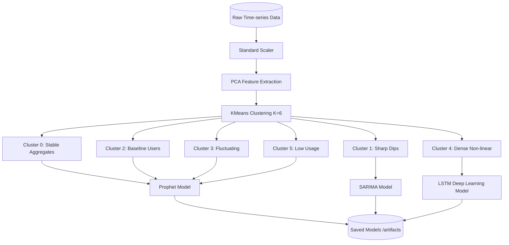

# VoltForecast AI - Second Deliverable

**🔗 [Live Dashboard](https://share.streamlit.io/)** *(Replace with your actual Streamlit Cloud URL after deployment)*

Welcome to the **VoltForecast AI** project! This repository contains a production-ready, natural language interface for electricity consumption forecasting. It leverages advanced clustering techniques, specialized forecasting models (Prophet, SARIMA, LSTM), and the **Anthropic Claude 3** LLM to map user queries to the correct data models dynamically.

## 🌟 Features

*   **Natural Language Interface**: Ask for forecasts in plain English (e.g., *"Predict for MT_001 for the next 2 days"*).
*   **Intelligent Parsing**: Claude 3 automatically extracts the requested Client ID/Cluster and computes the desired forecasting time frame.
*   **Specialized Forecasting Models**:
    *   **Prophet**: For stable aggregates and highly variable profiles.
    *   **SARIMA**: For single clients with sharp, frequent dips (high base load).
    *   **LSTM**: For dense aggregates with complex, non-linear patterns.
*   **Premium Streamlit Dashboard**: A beautiful, deep-blue themed interactive UI with area charts and execution reasoning.

## 🚀 Setup & Installation

This project uses `uv` for lightning-fast Python dependency management.

1. **Clone the repository and checkout the branch**:
   ```bash
   git clone <repository-url>
   cd Forecasting-project
   git checkout Second-Deliverable
   ```

2. **Sync the environment**:
   ```bash
   uv sync
   ```

3. **Configure the Environment Variable**:
   The LLM interface requires an Anthropic API key. Create a `.env` file in the root of the project:
   ```env
   ANTHROPIC_API_KEY=sk-ant-your-api-key-here
   ```

4. **Add the Dataset (Optional for UI, Required for Training)**:
   Ensure `LD2011_2014 2.txt` is in the root directory if you plan to re-train the models.

## 🖥️ Running the Application

Start the interactive Streamlit dashboard:

```bash
uv run streamlit run streamlit_app.py
```

The application will be universally accessible at `http://localhost:8501`.

## 🏗️ System Architecture


```mermaid
graph TD
    User([User]) -->|Natural Language Prompt| UI[Streamlit Frontend]
    UI -->|Query String| Claude[Anthropic Claude 3 LLM]
    Claude -->|Extracts JSON: client_id, period| Interface{Python Mapping Interface}
    Interface -->|Lookup Client ID| Mapping[(client_mapping.json)]
    Mapping -->|Returns Cluster ID| Interface
    Interface -->|Dynamically Load Model| Models[(Pre-trained Models Directory)]
    Models -->|Prophet / SARIMA / LSTM| Engine[Inference Engine]
    Engine -->|yhat Forecast| UI
    UI -->|Renders Area Chart| User
```

1.  **`train_final.py`**: Reads the raw data, applies PCA and KMeans clustering (K=6), and trains a distinct predictive model for each cluster. It also saves the `client_mapping.json` so individual clients can be mapped to their parent clusters.
2.  **`llm_interface.py`**: The core bridge between natural language and the models. It sends prompts to Anthropic Claude 3 to extract parameters, maps them, and dynamically loads the respective `.json`, `.keras`, or `.statsmodels` artifact from the `/models` directory.
3.  **`streamlit_app.py`**: The frontend dashboard that coordinates user inputs and visualizes the generated predictions.

## 🧠 Model Training & Clustering Flow


```mermaid
graph TD
    Raw[(Raw Time-series Data)] --> Scale[Standard Scaler]
    Scale --> PCA[PCA Feature Extraction]
    PCA --> KMeans[KMeans Clustering K=6]
    
    KMeans --> C0[Cluster 0: Stable Aggregates]
    KMeans --> C1[Cluster 1: Sharp Dips]
    KMeans --> C2[Cluster 2: Baseline Users]
    KMeans --> C3[Cluster 3: Fluctuating]
    KMeans --> C4[Cluster 4: Dense Non-linear]
    KMeans --> C5[Cluster 5: Low Usage]
    
    C0 & C2 & C3 & C5 --> Prophet[Prophet Model]
    C1 --> SARIMA[SARIMA Model]
    C4 --> LSTM[LSTM Deep Learning Model]
    
    Prophet & SARIMA & LSTM --> Export[(Saved Models /artifacts)]
```

---
*Built for the Second Deliverable.*
